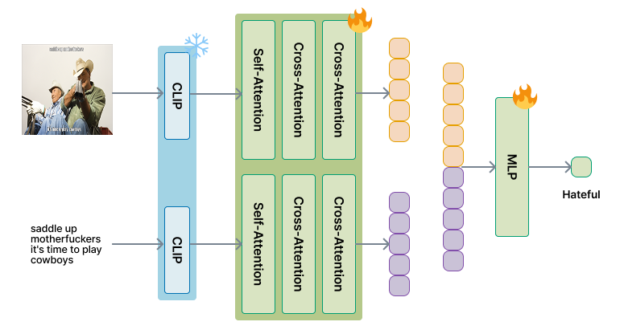
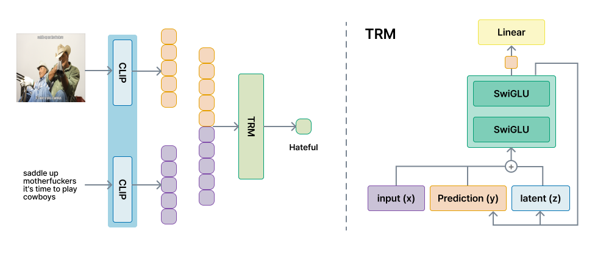

# Hateful Meme Detection

## 🖼️ Dataset

The Hateful Memes Challenge by Meta (2020): [docs](https://ai.meta.com/tools/hatefulmemes/)

*Image is a compilation of assets, including ©Getty Image.*


## 🛠️ Experiments

- OS: Ubuntu 24.04.1 LTS
- GPU: RTX 4060 (8GB) x1
- RAM: 32GB

|Model|config|AUC|Accuracy|F1|
|:---:|:---:|:---:|:---:|:---:|
|CLIP|[mlp](./config/mlp.yaml)|**0.826**|0.754|0.658|
|CLIP + Cross Attention|[ca](./config/ca.yaml)|0.825|**0.758**|0.659|
|CLIP + TRM|[trm](./config/trm.yaml)|0.819|0.727|**0.676**|

Since the ground-truth labels of the original test set are not accessible, the original validation set was repurposed as the test set, and the original training set was split at an 8:2 ratio to construct the new training and validation sets  ([data](./data)).

### Previous Works

Check [the-results](https://www.drivendata.org/competitions/64/hateful-memes/#the-results) for more details.

|Model|AUC|Accuracy|
|:---:|:---:|:---:|
|ViLBERT CC|0.708|0.704|
|Visual BERT COCO|0.737|0.708|
|VL-BERT (#1)|-|-|
|VILIO (#2)|0.816|-|
|VisualBERT (#3)|0.752|0.710|
|UNITER (#4)|0.791|-|

Since the original validation set was used as the test set for evaluation, the performance of the comparison models are also recorded based on their validation set scores.

## ▶️ Train

All images should be placed under the `data/img/` directory (e.g. `data/img/01329.png`).

Generate the `.env` file based on `.env.example`.

```sh
pip install -r requirements.txt
python utils/load_clip.py
python utils/preprocess.py
```

### Cross Attention



```sh
python train.py --config-name ca
```

### Tiny Reasoning Model



```sh
python train_trm.py --config-name trm
```

Check [trm_pseudo](./assets/trm_pseudo.md) for more details.

## 📋 Docs

- Korean: [Tech Blog](https://denev6.github.io/posts/multimodal-trm/)
- English: [Academic Format](/assets/experiments.pdf)
